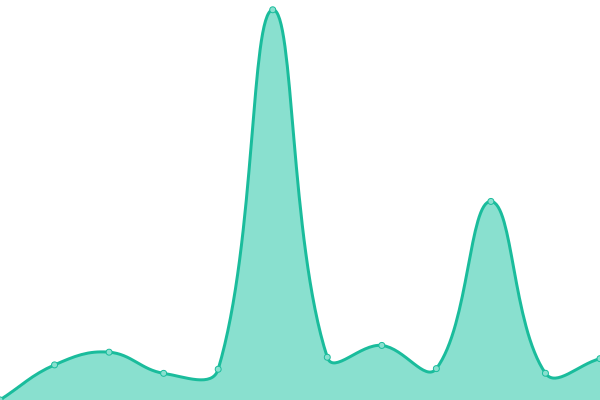

# [📈 Live Status](https://status-dev.lizardbyte.dev): <!--live status--> **🟨 Degraded performance**

This repository contains the open-source uptime monitor and status page for [LizardByte (infrastructure)](https://status-dev.lizardbyte.dev), powered by [Upptime](https://github.com/upptime/upptime).

With [Upptime](https://upptime.js.org), you can get your own unlimited and free uptime monitor and status page, powered entirely by a GitHub repository. We use [Issues](https://github.com/LizardByte-infrastructure/upptime-dev/issues) as incident reports, [Actions](https://github.com/LizardByte-infrastructure/upptime-dev/actions) as uptime monitors, and [Pages](https://status-dev.lizardbyte.dev) for the status page.

<!--start: status pages-->
<!-- This summary is generated by Upptime (https://github.com/upptime/upptime) -->
<!-- Do not edit this manually, your changes will be overwritten -->
<!-- prettier-ignore -->
| URL | Status | History | Response Time | Uptime |
| --- | ------ | ------- | ------------- | ------ |
|  [Canonical and Ubuntu Status](https://status.canonical.com/) | 🟨 Degraded | [canonical-and-ubuntu-status.yml](https://github.com/LizardByte-infrastructure/upptime-dev/commits/HEAD/history/canonical-and-ubuntu-status.yml) | 

 606ms
     
 | 

<a href="https://status-dev.lizardbyte.dev/history/canonical-and-ubuntu-status">6.87%</a>
    

|  [Codecov Status](https://status.codecov.com/) | 🟩 Up | [codecov-status.yml](https://github.com/LizardByte-infrastructure/upptime-dev/commits/HEAD/history/codecov-status.yml) | 

 355ms
     
 | 

<a href="https://status-dev.lizardbyte.dev/history/codecov-status">100.00%</a>
    

|  [crowdin Status](https://status.crowdin.com/) | 🟩 Up | [crowdin-status.yml](https://github.com/LizardByte-infrastructure/upptime-dev/commits/HEAD/history/crowdin-status.yml) | 

 597ms
     
 | 

<a href="https://status-dev.lizardbyte.dev/history/crowdin-status">100.00%</a>
    

|  [Fedora Infrastructure Status](https://status.fedoraproject.org/) | 🟩 Up | [fedora-infrastructure-status.yml](https://github.com/LizardByte-infrastructure/upptime-dev/commits/HEAD/history/fedora-infrastructure-status.yml) | 

 574ms
     
 | 

<a href="https://status-dev.lizardbyte.dev/history/fedora-infrastructure-status">100.00%</a>
    

|  [GitHub Status](https://www.githubstatus.com/) | 🟩 Up | [git-hub-status.yml](https://github.com/LizardByte-infrastructure/upptime-dev/commits/HEAD/history/git-hub-status.yml) | 

 183ms
     
 | 

<a href="https://status-dev.lizardbyte.dev/history/git-hub-status">100.00%</a>
    

|  [npm Status](https://status.npmjs.org/) | 🟩 Up | [npm-status.yml](https://github.com/LizardByte-infrastructure/upptime-dev/commits/HEAD/history/npm-status.yml) | 

 254ms
     
 | 

<a href="https://status-dev.lizardbyte.dev/history/npm-status">100.00%</a>
    

|  [Python Infrastructure Status](https://status.python.org/) | 🟩 Up | [python-infrastructure-status.yml](https://github.com/LizardByte-infrastructure/upptime-dev/commits/HEAD/history/python-infrastructure-status.yml) | 

 257ms
     
 | 

<a href="https://status-dev.lizardbyte.dev/history/python-infrastructure-status">100.00%</a>
    

|  [Read the Docs Status](https://status.readthedocs.com/) | 🟩 Up | [read-the-docs-status.yml](https://github.com/LizardByte-infrastructure/upptime-dev/commits/HEAD/history/read-the-docs-status.yml) | 

 420ms
     
 | 

<a href="https://status-dev.lizardbyte.dev/history/read-the-docs-status">100.00%</a>
    

|  [SonarCloud Status](https://sonarcloud.statuspage.io/) | 🟩 Up | [sonar-cloud-status.yml](https://github.com/LizardByte-infrastructure/upptime-dev/commits/HEAD/history/sonar-cloud-status.yml) | 

 336ms
     
 | 

<a href="https://status-dev.lizardbyte.dev/history/sonar-cloud-status">100.00%</a>
    

<!--end: status pages-->

[**Visit our status website →**](https://status-dev.lizardbyte.dev)

## 📄 License

- Powered by: [Upptime](https://github.com/upptime/upptime)
- Code: [MIT](./LICENSE) © [Anand Chowdhary](https://anandchowdhary.com), supported by [Pabio](https://pabio.com)
- Data in the `./history` directory: [Open Database License](https://opendatacommons.org/licenses/odbl/1-0/)
