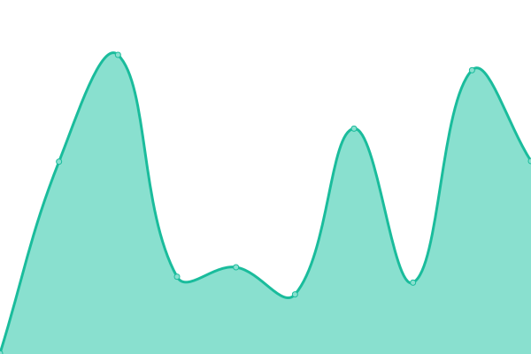

# [📈 Live Status](https://status-dev.lizardbyte.dev): <!--live status--> **🟩 All systems operational**

This repository contains the open-source uptime monitor and status page for [LizardByte (infrastructure)](https://status-dev.lizardbyte.dev), powered by [Upptime](https://github.com/upptime/upptime).

With [Upptime](https://upptime.js.org), you can get your own unlimited and free uptime monitor and status page, powered entirely by a GitHub repository. We use [Issues](https://github.com/LizardByte-infrastructure/upptime-dev/issues) as incident reports, [Actions](https://github.com/LizardByte-infrastructure/upptime-dev/actions) as uptime monitors, and [Pages](https://status-dev.lizardbyte.dev) for the status page.

<!--start: status pages-->
<!-- This summary is generated by Upptime (https://github.com/upptime/upptime) -->
<!-- Do not edit this manually, your changes will be overwritten -->
<!-- prettier-ignore -->
| URL | Status | History | Response Time | Uptime |
| --- | ------ | ------- | ------------- | ------ |
|  [Codecov](https://status.codecov.com/) | 🟩 Up | [codecov.yml](https://github.com/LizardByte-infrastructure/upptime-dev/commits/HEAD/history/codecov.yml) | 

 432ms
     
 | 

<a href="https://status-dev.lizardbyte.dev/history/codecov">97.12%</a>
    

|  [crowdin](https://status.crowdin.com/) | 🟩 Up | [crowdin.yml](https://github.com/LizardByte-infrastructure/upptime-dev/commits/HEAD/history/crowdin.yml) | 

 460ms
     
 | 

<a href="https://status-dev.lizardbyte.dev/history/crowdin">97.42%</a>
    

|  [Docker Infrastructure](https://www.dockerstatus.com/) | 🟩 Up | [docker-infrastructure.yml](https://github.com/LizardByte-infrastructure/upptime-dev/commits/HEAD/history/docker-infrastructure.yml) | 

 216ms
     
 | 

<a href="https://status-dev.lizardbyte.dev/history/docker-infrastructure">100.00%</a>
    

|  [Fedora Infrastructure](https://status.fedoraproject.org/) | 🟩 Up | [fedora-infrastructure.yml](https://github.com/LizardByte-infrastructure/upptime-dev/commits/HEAD/history/fedora-infrastructure.yml) | 

 689ms
     
 | 

<a href="https://status-dev.lizardbyte.dev/history/fedora-infrastructure">96.41%</a>
    

|  [Flathub](https://status.flathub.org/) | 🟩 Up | [flathub.yml](https://github.com/LizardByte-infrastructure/upptime-dev/commits/HEAD/history/flathub.yml) | 

 336ms
     
 | 

<a href="https://status-dev.lizardbyte.dev/history/flathub">100.00%</a>
    

|  [GitHub](https://www.githubstatus.com/) | 🟩 Up | [git-hub.yml](https://github.com/LizardByte-infrastructure/upptime-dev/commits/HEAD/history/git-hub.yml) | 

 201ms
     
 | 

<a href="https://status-dev.lizardbyte.dev/history/git-hub">96.05%</a>
    

|  [npm](https://status.npmjs.org/) | 🟩 Up | [npm.yml](https://github.com/LizardByte-infrastructure/upptime-dev/commits/HEAD/history/npm.yml) | 

 213ms
     
 | 

<a href="https://status-dev.lizardbyte.dev/history/npm">97.84%</a>
    

|  [Python Infrastructure](https://status.python.org/) | 🟩 Up | [python-infrastructure.yml](https://github.com/LizardByte-infrastructure/upptime-dev/commits/HEAD/history/python-infrastructure.yml) | 

 396ms
     
 | 

<a href="https://status-dev.lizardbyte.dev/history/python-infrastructure">97.53%</a>
    

|  [Read the Docs](https://status.readthedocs.com/checks?sEcho=1&iColumns=1&sColumns=status&iDisplayStart=0&iDisplayLength=50) | 🟩 Up | [read-the-docs.yml](https://github.com/LizardByte-infrastructure/upptime-dev/commits/HEAD/history/read-the-docs.yml) | 

 1343ms
     
 | 

<a href="https://status-dev.lizardbyte.dev/history/read-the-docs">99.27%</a>
    

|  [SonarCloud](https://sonarcloud.statuspage.io/) | 🟩 Up | [sonar-cloud.yml](https://github.com/LizardByte-infrastructure/upptime-dev/commits/HEAD/history/sonar-cloud.yml) | 

 285ms
     
 | 

<a href="https://status-dev.lizardbyte.dev/history/sonar-cloud">97.83%</a>
    

<!--end: status pages-->

[**Visit our status website →**](https://status-dev.lizardbyte.dev)

## 📄 License

- Powered by: [Upptime](https://github.com/upptime/upptime)
- Code: [MIT](./LICENSE) © [Anand Chowdhary](https://anandchowdhary.com), supported by [Pabio](https://pabio.com)
- Data in the `./history` directory: [Open Database License](https://opendatacommons.org/licenses/odbl/1-0/)
